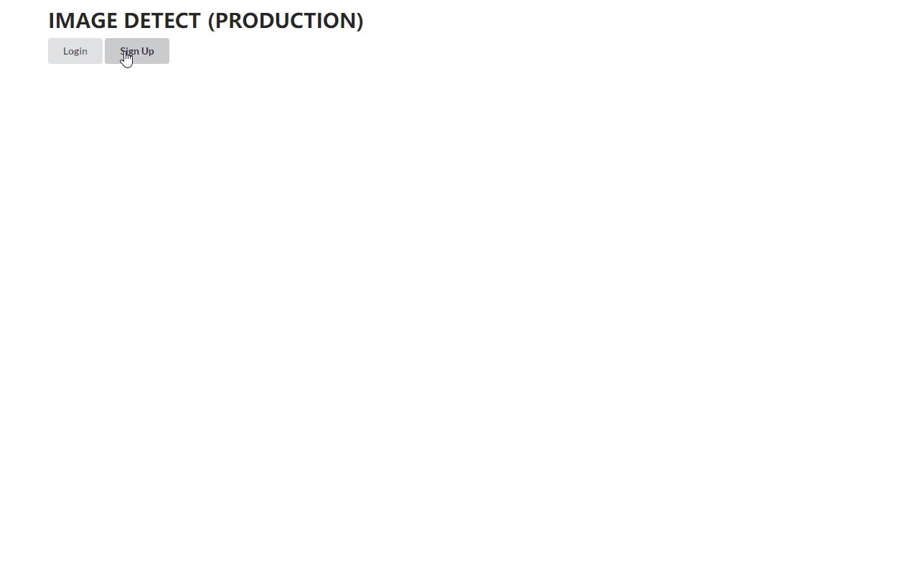

# react-firestore-google-cloud-api-demo

https://logical-fabric.firebaseapp.com/



## Features

- uses:

  - ES2017
  - React (create-react-app)
  - Redux
  - Firebase Firestore
  - Firebase Functions
  - Firebase Hosting
  - Google Vision API
  - Semantic UI
  - Prettier
  - Puppeteer
  - Jest
  - Lodash

- features:
  - Sign In
  - Sign Up
  - Sign Out
  - Protected with Authorization
  - Detect Image Label by URL
  - Detect Image Label by upload local file
  - View, Delete persisted data from server
  - Search / Filter Images by Label
  - Use Jest and Puppeteer for Unit test

## Contributors

- [Xi Ming (seki2020)](https://github.com/seki2020)

## Installation

- `git clone https://github.com/seki2020/lf-image.git`
- `cd lf-image`
- `npm install`
-  get firebase credentials
-  get Google Cloud credentials file
-  create .env file in local
-  change functions/index.js to load local credential file downloaded
- `firebase init`
- `firebase serve --only functions`
- `npm start`
-  visit http://localhost:3000

Get an overview of Firebase, how to create a project, what kind of features Firebase offers, and how to navigate through the Firebase project dashboard in this [visual tutorial for Firebase](https://www.robinwieruch.de/firebase-tutorial/).

### Firebase Configuration

- copy/paste your configuration from your Firebase project's dashboard into one of these files
  - _src/components/Firebase/firebase.js_ file
  - _.env_ file
  - _.env.development_ and _.env.production_ files

The _.env_ or _.env.development_ and _.env.production_ files could look like the following then:

```
REACT_APP_API_KEY=AIzaSyBtxZ3phPeXcsZsRTySIXa7n33NtQ
REACT_APP_AUTH_DOMAIN=react-firebase-s2233d64f8.firebaseapp.com
REACT_APP_DATABASE_URL=https://react-firebase-s2233d64f8.firebaseio.com
REACT_APP_PROJECT_ID=react-firebase-s2233d64f8
REACT_APP_STORAGE_BUCKET=react-firebase-s2233d64f8.appspot.com
REACT_APP_MESSAGING_SENDER_ID=701928454501
```

### Activate Sign-In Methods


- Email/Password
- [Google](https://www.robinwieruch.de/react-firebase-social-login/)
- [Facebook](https://www.robinwieruch.de/firebase-facebook-login/)
- [Twitter](https://www.robinwieruch.de/firebase-twitter-login/)
- [Troubleshoot](https://www.robinwieruch.de/react-firebase-social-login/)

### Activate Verification E-Mail

- add a redirect URL for redirecting a user after an email verification into one of these files
  - _src/components/Firebase/firebase.js_ file
  - _.env_ file
  - _.env.development_ and _.env.production_ files

The _.env_ or _.env.development_ and _.env.production_ files could look like the following then (excl. the Firebase configuration).

**Development:**

```
REACT_APP_CONFIRMATION_EMAIL_REDIRECT=http://localhost:3000
```

**Production:**

```
REACT_APP_CONFIRMATION_EMAIL_REDIRECT=https://mydomain.com
```

### Security Rules

```
service cloud.firestore {
  match /databases/{database}/documents {

    // Custom functions
    function signedIn() {
        return request.auth != null;
    }

    function isAdmin() {
        return signedIn() &&
        	'ADMIN'in get(/databases/$(database)/documents/users/$(request.auth.uid)).data.roles.values();
    }

    function ownsMessage() {
        return signedIn() && request.auth.uid == resource.data.userId;
    }

    function isSelf() {
    	    return signedIn() && request.auth.uid == resource.id;
    }

    // Rules
    match /users/{userId} {
        allow get: if isSelf();
        allow list: if isAdmin();
        allow write:  if isSelf() || isAdmin();
    }

    match /messages/{messageId} {
        allow read: if signedIn();
        allow create: if signedIn();
        allow update, delete: if signedIn() && ownsMessage();
    }
  }
}
```
